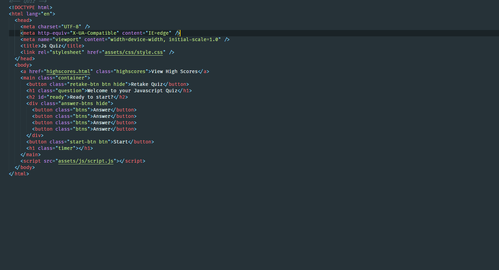
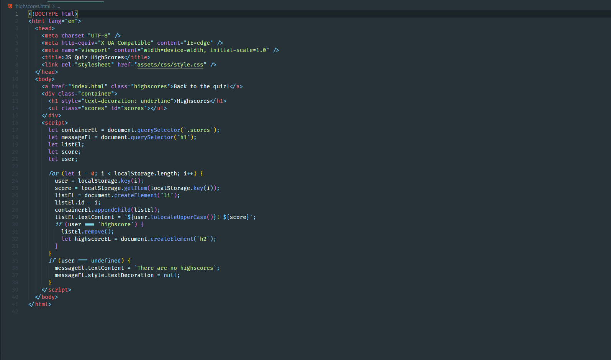
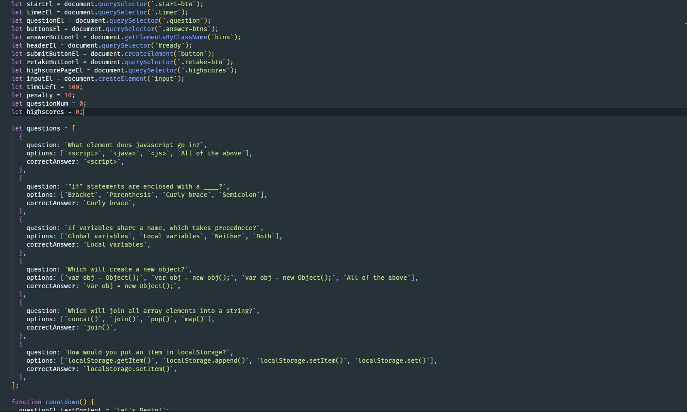
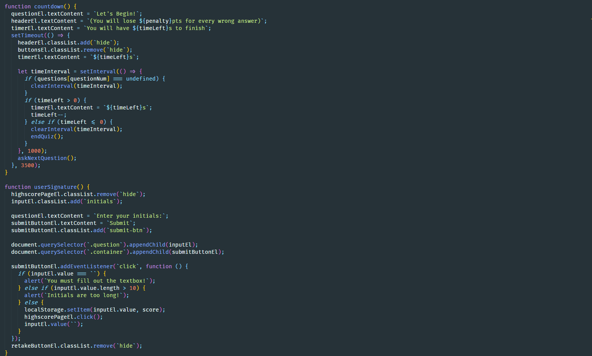
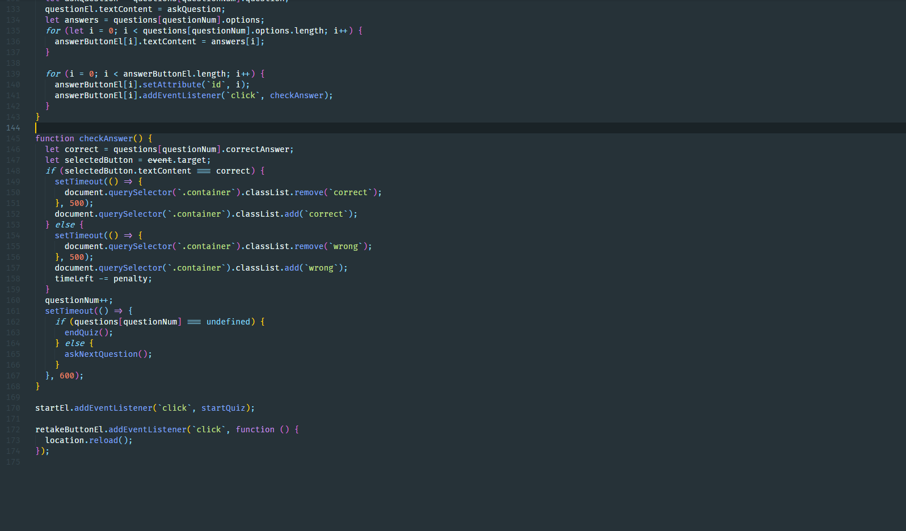

# Javascript Multiple Choice Quiz

## Description

In this challenge Javascript, CSS, and HTML were used to dynamically create a timed assessment about Javascript. For every incorrect answer the quiz time will decrement, resulting in a lower score. Highscores should be viewable to the user.

## Screenshots

## Links

https://lclark31.github.io/JavaScript-Mini-Quiz/
